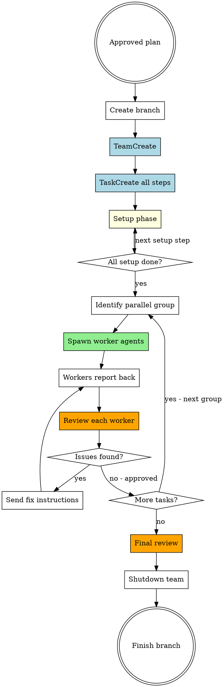
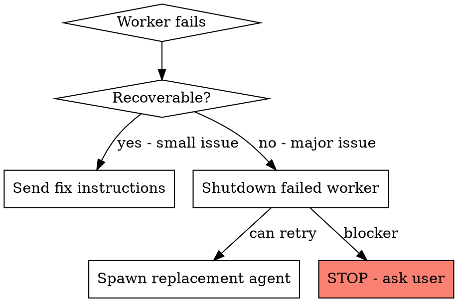

# Executing with Team Agents

Execute an approved plan by creating a team, running setup sequentially, then spawning parallel worker agents for implementation tasks.

**Prerequisite:** An approved plan from `orchestrating-team-agents` skill.

## Core Flow



## Step 1: Create Branch & Team

```
git checkout -b <branch-from-plan>

TeamCreate(team_name="<plan-name>")
```

## Step 2: Create All Tasks

Create every step from the plan as a task with proper dependencies:

```
Setup tasks:
  TaskCreate(subject="S1: <desc>", description="<full details>")
  TaskCreate(subject="S2: <desc>", description="<full details>")
  TaskUpdate(taskId="S2", addBlockedBy=["S1"])

Implementation tasks:
  TaskCreate(subject="T1: <desc>", description="<full task text + state diagram>")
  TaskCreate(subject="T2: <desc>", description="<full task text + state diagram>")
  TaskUpdate(taskId="T1", addBlockedBy=["S1", "S2"])
  TaskUpdate(taskId="T2", addBlockedBy=["S1", "S2"])
```

**Include in each task description:**
- Full task text from plan (not a reference — paste it)
- State diagram from plan
- Exact files the agent may touch
- What to test and expected outcome

## Step 3: Setup Phase (You Execute — Sequential)

Run setup steps yourself. These are foundational (migrations, types, configs) and must be sequential:

```
For each setup task (in order):
  1. TaskUpdate(taskId, status="in_progress")
  2. Implement the step
  3. Verify it works
  4. Commit: git add <specific-files> && git commit
  5. TaskUpdate(taskId, status="completed")
```

**Do NOT spawn agents for setup.** Setup is fast, sequential, and touches shared foundations.

## Step 4: Spawn Worker Agents (Parallel)

After setup, identify the next group of parallelizable tasks from the plan and spawn agents:

```
Agent(
  subagent_type="general-purpose",
  team_name="<plan-name>",
  name="worker-T1",
  mode="bypassPermissions",
  prompt=<use ./worker-prompt.md template>
)
```

**Spawn rules:**

| Rule | Detail |
|------|--------|
| Max concurrent agents | 3 (prevents conflicts) |
| One task per agent | Never give agent multiple tasks |
| Full context in prompt | Paste full task text + diagram + file scope |
| No file overlap | Validated during planning — enforce here |

**Wait for all agents in the group to complete before spawning next group.**

## Step 5: Review Each Worker's Output

After each worker reports back, run two-stage review:

### Stage 1: Spec Compliance

Dispatch a review agent using `./spec-reviewer-prompt.md`:

```
Agent(
  subagent_type="general-purpose",
  name="reviewer-T1-spec",
  prompt=<spec reviewer template with task spec + worker report>
)
```

- If issues → send fix instructions to worker via `SendMessage`
- Worker fixes → re-review
- Repeat until spec compliant

### Stage 2: Code Quality

Only after spec passes. Dispatch using `./code-quality-reviewer-prompt.md`:

```
Agent(
  subagent_type="general-purpose",
  name="reviewer-T1-quality",
  prompt=<code quality template with BASE_SHA + HEAD_SHA>
)
```

- If issues → send fix instructions to worker
- Worker fixes → re-review
- Repeat until approved

**Mark task completed only after both reviews pass:**
```
TaskUpdate(taskId, status="completed")
```

## Step 6: Next Parallel Group

Check the plan for the next group of tasks whose dependencies are now satisfied:

```
TaskList() → find tasks with status="pending" and all blockedBy resolved
```

Repeat Steps 4-5 for each group until all tasks complete.

## Step 7: Final Review & Shutdown

After all tasks are done:

1. **Final code review** — dispatch reviewer for entire implementation:
   ```
   Agent(
     subagent_type="superpowers:code-reviewer",
     name="final-reviewer",
     prompt="Review all changes on branch <branch> since branching from main"
   )
   ```

2. **Shutdown workers** — send shutdown to all active agents:
   ```
   SendMessage(type="shutdown_request", recipient="worker-T1", content="All tasks done")
   ```

3. **Finish branch** — use `superpowers:finishing-a-development-branch`

4. **Cleanup team:**
   ```
   TeamDelete()
   ```

## Worker Communication

### Orchestrator → Worker
Use `SendMessage` for:
- Fix instructions after review
- Clarifications when worker asks questions
- Context updates if earlier tasks changed shared code

```
SendMessage(
  type="message",
  recipient="worker-T1",
  content="Spec reviewer found: missing validation on X. Add it to file:line",
  summary="Fix missing validation"
)
```

### Worker → Orchestrator
Workers automatically send idle notifications when done. Their final message includes:
- What they implemented
- Test results
- Files changed
- Commit SHA

### Between Workers
Workers should NOT communicate directly. All coordination goes through orchestrator + task list.

## Error Handling



- **Small issues**: Send fix message, worker corrects
- **Agent stuck**: Shutdown + spawn fresh agent with same task
- **Blocker**: Stop execution, report to user with details

## Red Flags — Stop Execution

| Signal | Action |
|--------|--------|
| Worker edits file outside its scope | Stop worker, fix, re-review |
| Two workers committed to same file | Stop both, resolve conflict manually |
| Test suite fails after worker commit | Investigate before spawning next group |
| Worker asks question you can't answer | Ask user, don't guess |
| Setup step fails | Stop everything — foundation is broken |

## Never

- Skip spec review before code quality review (wrong order)
- Let workers communicate directly (coordination through orchestrator)
- Spawn more than 3 concurrent workers
- Re-plan during execution (the plan is the plan)
- Run setup steps in parallel (they're sequential for a reason)
- Let a worker proceed with unresolved questions
- Mark task complete before both reviews pass
- Start on main/master without user consent
