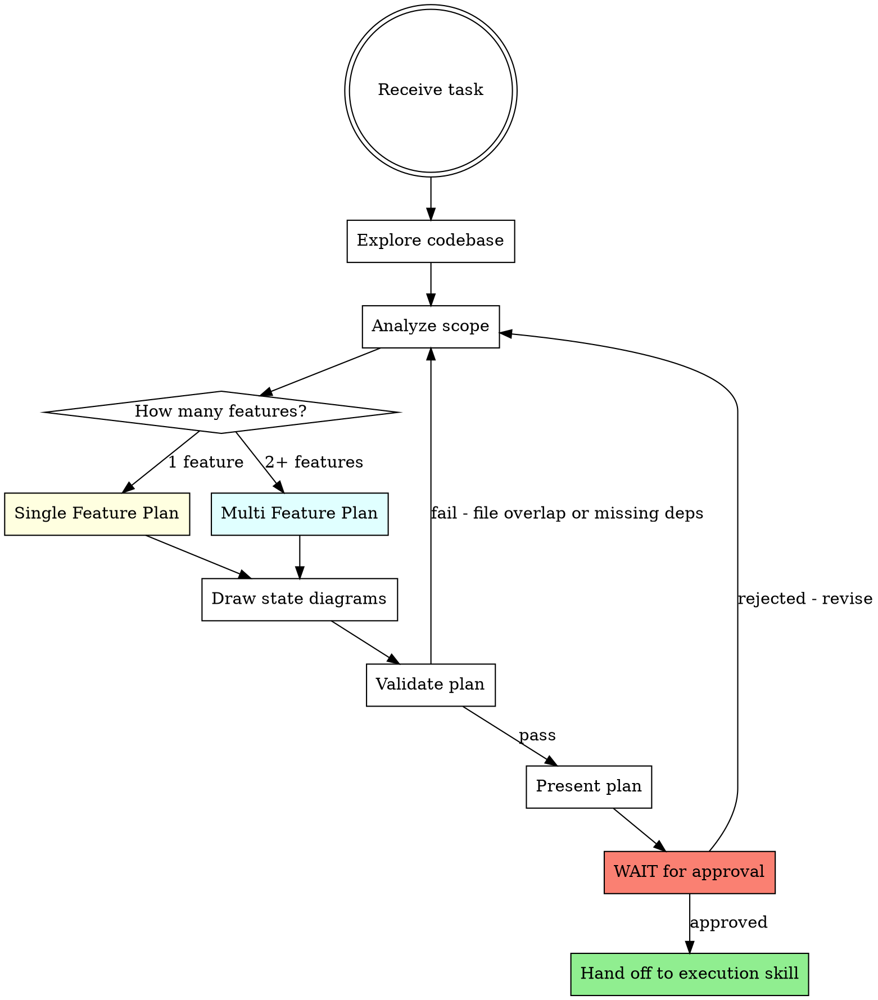
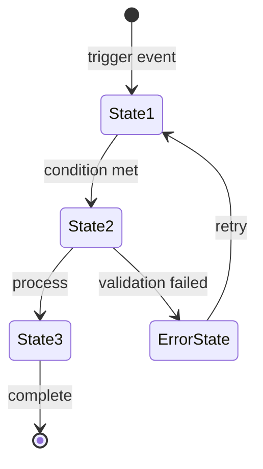

# Orchestrating Team Agents — Planning Skill

**STOP. You MUST complete this planning workflow before touching ANY code.**

Every task goes through this skill first. Output = a plan ready for team agent execution.

## Core Flow



## Step 1: Explore Codebase

Before planning, understand what exists:
- `git diff` to see current state
- Read relevant files in the affected area
- Identify existing patterns, types, interfaces
- Note the architecture (hexagonal: domain → ports → adapters)

## Step 2: Analyze & Classify

Determine:
- **How many features** does this task involve?
- **What files** will each feature touch?
- **What dependencies** exist between them?
- **What setup** is needed first (schemas, types, configs)?

## Step 3: Build the Plan

### Path A — Single Feature

One feature = plan focused on team agent task distribution:

```
Plan: <feature-name>
Goal: <one sentence>
Branch: feature/<ticket>-<description>

Setup (sequential — complete before implementation):
  S1: <migration/schema> → [exact files]
  S2: <types/interfaces/ports> → [exact files]
  S3: <shared configs> → [exact files]

Implementation (parallel-ready — one agent per task):
  T1: <domain logic>
      Files: [exact files — NO overlap with T2-T4]
      State: <mermaid diagram>
      Test: <what to verify>

  T2: <adapter implementation>
      Files: [exact files — NO overlap with T1,T3,T4]
      State: <mermaid diagram>
      Test: <what to verify>

  T3: <API handler/endpoint>
      Files: [exact files — NO overlap with T1,T2,T4]
      State: <mermaid diagram>
      Test: <what to verify>

  T4: <UI component>
      Files: [exact files — NO overlap with T1-T3]
      State: <mermaid diagram>
      Test: <what to verify>
```

### Path B — Multiple Features

Multiple features = break into smallest tasks grouped by feature:

```
Plan: <epic-name>
Goal: <one sentence>
Branch: feature/<ticket>-<description>

Feature 1: <name>
  Setup:
    S1.1: <schema> → [exact files]
    S1.2: <types> → [exact files]
  Tasks:
    T1.1: <domain> → [files] + state diagram + test
    T1.2: <adapter> → [files] + state diagram + test

Feature 2: <name>
  Setup:
    S2.1: <schema> → [exact files]
  Tasks:
    T2.1: <domain> → [files] + state diagram + test
    T2.2: <handler> → [files] + state diagram + test

Cross-feature dependencies:
  T2.1 blockedBy S1.2 (uses shared types)
  Feature 2 tasks can parallel with Feature 1 tasks (except T2.1)

Execution order:
  Phase A (sequential): S1.1 → S1.2 → S2.1
  Phase B (parallel): T1.1 | T1.2 | T2.2
  Phase C (after Phase A+B): T2.1
```

**Key rules for multi-feature:**
- Group tasks by feature for clarity
- Map cross-feature dependencies explicitly
- Show parallelizable groups and sequential constraints
- Keep plan readable — split into phases if too large

## Step 4: State Diagrams

For **every task with logic or state transitions**, include a mermaid diagram:



## Step 5: Validate Plan

Before presenting, check:

| Check | Pass? |
|-------|-------|
| Zero file overlap between parallel tasks | |
| Every logic task has a state diagram | |
| Setup steps listed before implementation | |
| Dependencies between tasks are explicit | |
| Each task is independently testable | |
| Each task is one agent's worth of work | |
| Exact file paths specified per task | |

If any check fails → revise the plan before presenting.

## Step 6: Present & WAIT

Present the complete plan showing:
1. Objective & scope
2. Branch name
3. Setup steps (sequential order)
4. Implementation tasks (with parallel/sequential grouping)
5. State diagrams per logic task
6. Dependency map
7. Suggested execution approach

**STOP. Wait for explicit user approval before proceeding.**

## After Approval — Hand Off to Execution

Once approved, use `executing-with-team-agents` skill to:
1. Create team + tasks from this plan
2. Run setup sequentially
3. Spawn parallel worker agents for implementation
4. Two-stage review per worker (spec → quality)
5. Final review + finish branch

Do NOT re-plan during execution. The plan is the plan.

## Task Sizing Guide

Each task should be scoped so one agent can:
- Understand the full context from the task description alone
- Implement without needing files from other agent's tasks
- Write tests for their work independently
- Complete in a single focused session
- Produce one meaningful commit

**Too big?** Break it down. If a task touches more than 3 files, consider splitting.
**Too small?** Merge adjacent tasks if they share files anyway.

## Red Flags — Replan

| Signal | Action |
|--------|--------|
| Two tasks touch the same file | Merge into one task or make sequential |
| Task needs output from another task | Add explicit dependency (blockedBy) |
| No state diagram for logic task | Add one — forces you to think through transitions |
| Task description requires reading other tasks to understand | Make it self-contained |
| Skipping planning "because it's small" | Use this workflow anyway |

## Rationalization Table

| Excuse | Reality |
|--------|---------|
| "Too small to plan" | Small tasks break too. Plan takes 2 minutes. |
| "I'll just do it quickly" | Quick hacks create tech debt. Plan first. |
| "Only one file changes" | One file can have complex state. Diagram it. |
| "Planning is overkill here" | Plans catch assumptions. Diagrams expose gaps. |
| "I know this codebase well" | Assumptions are the mother of all bugs. Plan. |
| "Let me just start coding" | NO. Plan → Approve → Execute. Always. |
